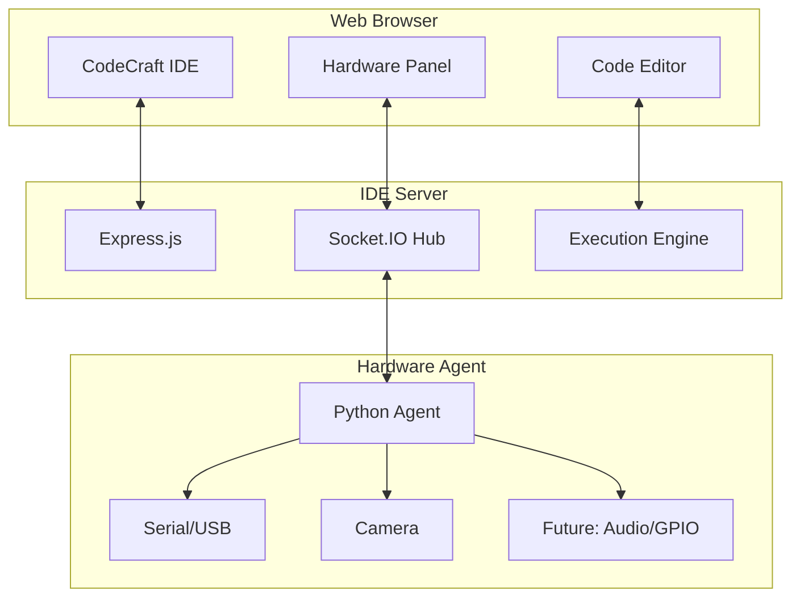

<div align="center">

# 🚀 CodeCraft IDE

**A Next-Generation Web-Based Integrated Development Environment**  
*Bridging Software Development and Hardware Integration*

[](https://nodejs.org/)
[](https://python.org/)
[](https://socket.io/)
[](LICENSE)

**🌟 Professional • 🔧 Hardware-Integrated • ⚡ Real-Time • 🌐 Web-Based**

[🚀 Quick Start](#-quick-start) • [📖 Features](#-features) • [🏗️ Architecture](#️-architecture) • [🤝 Contributing](#-contributing)

---

</div>

## ✨ **What Makes CodeCraft IDE Special**

CodeCraft IDE revolutionizes the development experience by seamlessly integrating **software development** with **hardware control**. Built on modern web technologies with a distributed architecture, it enables developers to write, test, and deploy code while simultaneously controlling physical hardware - all from a single, elegant interface.

> *"The future of development is not just about writing code, but about creating experiences that bridge the digital and physical worlds."*

### 🎯 **Features**

<table>
<tr>
<td width="50%">

### 💻 **Development Environment**
- **🎨 Code Editor**
  - Syntax highlighting for multiple languages
  - Themes (Dark/Light)
  - Tabs and split-view editing
- **🚀 Language Support (Implemented)**
  - JavaScript (Node.js ES6+)
  - Python (Full REPL with persistent session)
  - C/C++ (GCC compilation)
  - **CraftLang** (Custom-built language: lexer, parser, interpreter)
- **🔧 Integrated Tools**
  - Integrated terminal (node-pty based)
  - Project/file explorer (create/open/save/rename/delete)
  - Run/stop controls and error output panel
  - Directory import (Open Project/Folder)

</td>
<td width="50%">

### 🔌 **Hardware Integration**
- **📡 Serial/USB Communication**
  - Arduino, ESP32, sensors
  - Real-time data streaming
  - Multiple device support
- **📷 Camera Integration**
  - Live image capture
  - OpenCV processing
  - Base64 streaming
- **🏗️ Agent Architecture**
  - Secure token authentication
  - Multi-agent support
  - Cross-platform compatibility
- **⚡ Real-Time Control**
  - WebSocket communication
  - Live hardware feedback
  - Remote device management

</td>
</tr>
</table>

## 🚀 **Quick Start**

### **Prerequisites**
```bash
# Required
Node.js 18+    # JavaScript runtime
Python 3.8+    # Hardware agent & Python execution
Git            # Version control

# Optional (for hardware features)
GCC/G++        # C/C++ compilation
OpenCV         # Camera support
pyserial       # Serial communication
```

### **⚡ 60-Second Setup**

```bash
# 1️⃣ Clone the repository (or open the existing folder)
git clone <your-repo-url>
cd codecraft-ide

# 2️⃣ Install dependencies
cd server && npm install
cd ../agent && pip3 install -r requirements.txt

# 3️⃣ Start the IDE server
cd ../server && node index.js

# 4️⃣ Open browser → http://localhost:9000
```

### **🔧 Hardware Agent Setup** *(Optional)*
```bash
# In a separate terminal
cd agent

# Optional: set auth token if your server enforces it
export AGENT_AUTH_TOKEN="your-shared-secret"

# Start the agent and point it to the server
python3 hardware_agent.py --server http://localhost:9000 --auth-token "$AGENT_AUTH_TOKEN"

# Then in the IDE: toggle Hardware Mode (🔧) and select your agent/ports
```

## Usage

### Getting Started
1. **Create a new file**: Click the "New File" button or use Ctrl+N
2. **Select language**: Use the language dropdown to choose your programming language
3. **Write code**: Start coding in the editor with full syntax highlighting
4. **Run code**: Click the Run button (▶️) or press F5 to execute
5. **View output**: Check the console panel for program output and errors

### File Operations
- **New File**: Ctrl+N or click the new file button
- **Open File**: Ctrl+O or click the open file button
- **Save File**: Ctrl+S or click the save button
- **File Explorer**: Browse and open files from the left sidebar

### Debugging
1. **Set Breakpoints**: Click on line numbers to add/remove breakpoints
2. **Start Debugging**: Click the debug button (🐛)
3. **Debug Controls**: Use step over (F10), step into (F11), and continue buttons
4. **Watch Variables**: View variable values in the Variables panel

### Themes
- **Toggle Theme**: Click the theme button (🎨) to switch between dark and light themes
- **Dark Theme**: Monokai (default)
- **Light Theme**: Eclipse

## 🏗️ **Architecture**

### **🌐 Distributed System Design**



### **💡 Key Architectural Decisions**

| Component | Technology | Why This Choice |
|-----------|------------|----------------|
| **Frontend** | Vanilla JS + CodeMirror | Lightweight, fast, no framework overhead |
| **Backend** | Node.js + Express | Event-driven, perfect for real-time communication |
| **Communication** | Socket.IO | Bidirectional, auto-reconnection, event-based |
| **Hardware Agent** | Python | Rich hardware library ecosystem |
| **Code Execution** | Child Processes | Isolated, secure, language-agnostic |

### **📁 Project Structure**
```
codecraft-ide/
├── 🌐 client/                     # Frontend application
│   ├── index.html                # Main IDE interface
│   ├── styles.css                # Modern UI styling
│   └── js/ide.js                 # Core IDE functionality
├── ⚡ server/                     # Backend Node.js server
│   ├── index.js                  # Main server + Socket.IO routing
│   ├── compiler/                 # CraftLang implementation
│   │   ├── lexer.js             # Tokenization
│   │   ├── parser.js            # AST generation
│   │   ├── interpreter.js       # Execution engine
│   │   └── craftlang.js         # Language wiring
│   └── python/
│       └── repl_driver.py       # Persistent Python REPL (subprocess)
├── 🔧 agent/                     # Hardware agent (Python)
│   ├── hardware_agent.py        # Serial and camera support
│   ├── requirements.txt         # python-socketio, pyserial, opencv-python
│   └── README.md                # Agent documentation
└── 📁 workspace/                 # Sample user files/projects
    ├── hello.js                 # JavaScript example
    ├── hello.py                 # Python example
    ├── hello.cpp                # C++ example
    ├── *.craft                  # CraftLang examples
    └── ...
```

### 🔒 Configuration & Environment
- **Server port**: defaults to 9000
- **Hardware Agent auth**: set `AGENT_AUTH_TOKEN` on both server and agent to require authentication
- **Camera**: requires `opencv-python` on agent
- **Serial**: requires `pyserial` on agent

## Future Enhancements
- [ ] Autocomplete/IntelliSense
- [ ] Step debugger, breakpoints, variable watch
- [ ] Git integration
- [ ] Collaborative editing
- [ ] WebAssembly (WASM) for client-side compilation
- [ ] Docker-based sandboxed execution
- [ ] Project templates and scaffolding

## Contributing
This IDE is built as a demonstration of a full-stack development environment. Feel free to extend and modify it for your needs.

## License
Open source - feel free to use and modify as needed.
